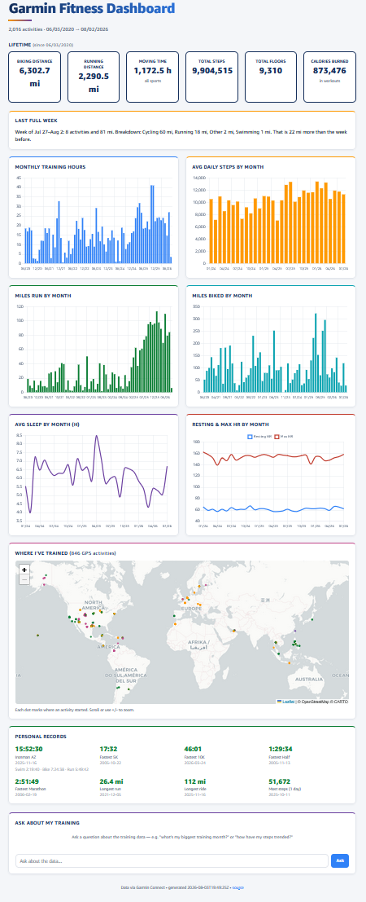

# Garmin Fitness Dashboard

A serverless dashboard for 6 years of personal Garmin data: lifetime stats, training trends, personal records, a worldwide "where I've trained" map, and an AI chat box that answers questions about the data.

**Live demo: https://dmcikdazkoyo2.cloudfront.net**

Built end to end: a Python data pipeline, a static front end, and an AWS serverless backend defined entirely in code with the CDK.

## Screenshots

See it live at **https://dmcikdazkoyo2.cloudfront.net**.

To add images to this README: drop `dashboard.png` and `map.png` into a `docs/` folder, then uncomment the two lines below.

<!--  -->
<!--  -->

## What it shows

- **Lifetime KPIs**: biking and running distance, moving time, total steps, floors climbed, average sleep.
- **Trends by month**: training hours, average daily steps, miles run, miles biked.
- **Personal records**: fastest 5K, 10K, half, and full marathon, longest run and ride, most steps in a day, and a full Ironman finish with splits. Real bests are entered by hand where they predate Garmin.
- **Where I've trained**: every GPS activity plotted worldwide, color-coded by sport.
- **Ask the data**: a chat box backed by Amazon Bedrock that answers questions like "what was my biggest training month?" using only the dashboard's data.

## Architecture

Everything is serverless and defined as infrastructure as code (AWS CDK, TypeScript).

```
Garmin Connect
     |  (Python pull + transform)
     v
  data.json / routes.json  ->  S3 (private)  ->  CloudFront (OAC)  ->  browser
                                                                          |
                                                              chat box POST /ask
                                                                          v
                                              API Gateway (HTTP, throttled)
                                                                          v
                                              Lambda (Python)  ->  Bedrock (Nova, Converse API)
                                                                          |
                                              DynamoDB rate counters (per-IP + global daily caps)
                                              SNS email alert + monthly budget alarm
```

- **S3 + CloudFront**: private bucket, served only through CloudFront with Origin Access Control.
- **Chat Lambda**: calls Bedrock through the model-agnostic Converse API. Per-IP and global daily question caps in DynamoDB act as a hard spend brake, with an SNS email alert when the global cap is hit.
- **Cost controls**: request throttling on the API, daily question caps, and a monthly AWS budget alarm. Runs at roughly $1 to $2 a month.

## Tech stack

- **Data**: Python (standard library), Garmin Connect API
- **Front end**: static HTML, Chart.js, Leaflet
- **Backend**: AWS Lambda, API Gateway, DynamoDB, S3, CloudFront, SNS, Budgets
- **GenAI**: Amazon Bedrock (Nova Lite via the Converse API)
- **Infra as code**: AWS CDK (TypeScript)

## How the pipeline works

```
pipeline/
  pull_activity_details.py   pull activities + GPS routes
  pull_wellness.py           pull daily wellness
  transform_wellness.py      raw wellness JSON -> curated daily CSV
  transform_routes.py        GPS traces -> routes.json (home clipped)
  render.py                  build data.json + index.html + app.js
  manual_records.json        hand-entered PRs (Ironman, pre-Garmin bests)
cdk/                         the AWS stack (S3, CloudFront, chat Lambda, API, DynamoDB, alerts)
refresh_and_publish.ps1      pull -> transform -> render -> sync S3 -> invalidate CloudFront
```

## Privacy

No personal health or GPS data is committed. `.gitignore` excludes `pipeline/out/`, the generated `site/` (the renderer inlines data into `index.html`), route GPS, and Garmin tokens. Map coordinates are rounded so a home address is not resolvable. The live dashboard reads its data from S3, not from git.

## Run it yourself

```bash
# build the site locally
python pipeline/render.py --chat-api-url https://<your-api>/ask
# open site/index.html

# deploy the AWS stack
cd cdk && npm install && npx cdk deploy
```

Built with [Kiro](https://kiro.dev). Data via Garmin Connect.
